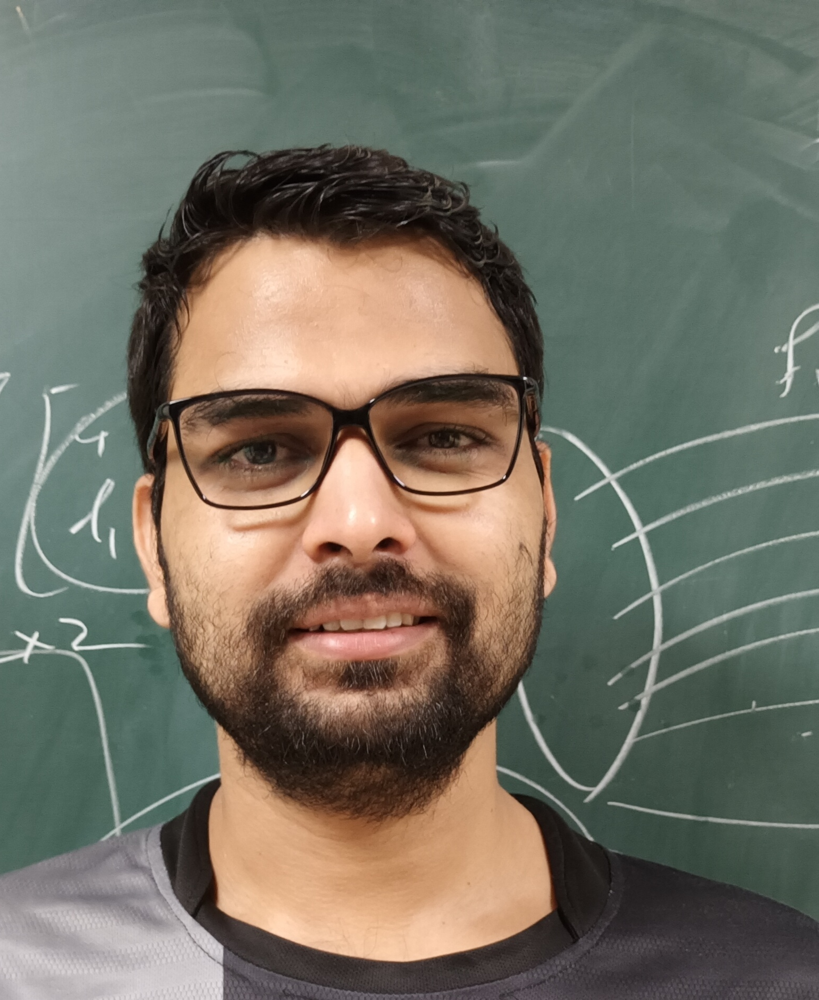

[About](about) | [Publications](publications) | [CV](cv) | [Contact](contact)

---

  

# Aman Awasthi

PhD Candidate in Physics  
Indian Institute of Technology Bombay  

---

I work in the areas of astrophysics and cosmology, with a focus on stellar physics, gravitational wave astrophysics, and observational probes of the Universe. My research explores the connections between stellar structure, astrophysical sources, and cosmological observations, combining theoretical modeling with data-driven approaches.

---

## Research Interests

- Stellar Physics and Helioseismology  
- Gravitational Wave Astrophysics  
- Observational Cosmology  
- Gravitational Microlensing  
- Dark Matter and Dark Energy  

---

## Current Work

My current research includes the study of solar g-modes and their detection prospects with space-based gravitational wave observatories, as well as ongoing work on the Hubble constant tension using supernova data. I am also developing analysis pipelines for gravitational microlensing studies in the context of upcoming surveys.

---

